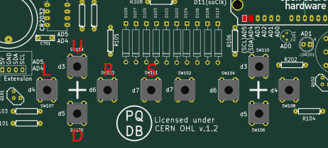

# PQDB PIC18F4520 Snake Game
 A snake game made for the PIC18F4520 microcontroller. Simulated in the PQDB board on PicSimLab.

## Installing
### PicSimLab
- Install PicSimLab
- Download and run the "simulation.pzw" file
### PythonSerialController
- Download the folder 
- Need python installed
```
pip install -r PythonSerialController/requirements.txt
```
- Run "serialController.py" while runing PicSimLab

## How to play
### Keys
- U -> Move Up
- L -> Move Left
- D -> Move Down
- R -> Move Right
- S -> Pause/Menu Interaction



### Python serial controller
- W = U
- A = L
- S = D
- D = R
- SPACE = S
- ESC -> Close serial controller

## Links

- Demo video: https://youtu.be/N025UB55-ng
- Songs ref: https://github.com/robsoncouto/arduino-songs
- PicSimLab: https://github.com/lcgamboa/picsimlab
- IDE: https://www.microchip.com/en-us/tools-resources/develop/mplab-x-ide
- XC8 Compiler: https://www.microchip.com/en-us/tools-resources/develop/mplab-xc-compilers 
